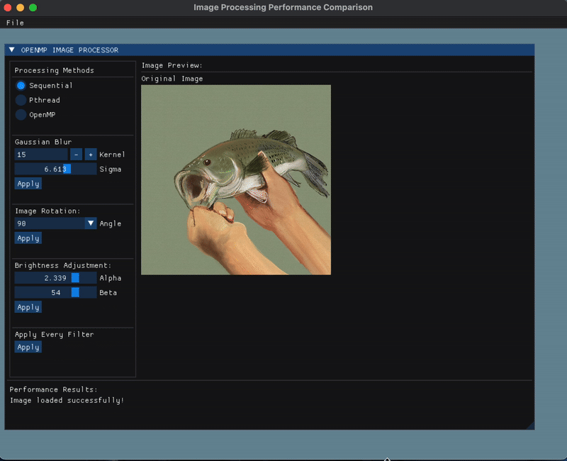

# OpenMP ImageProcessor

A GUI-based C++ application for comparing the efficiency of three methods: Sequential, Pthread and OpenMP. Designed to show how parallel programming can improve effiency in operations such as Gaussian blur, rotation, and brightness adjustment.

## Project Overview

This project implements and compares three different approaches for image processing:
- **Sequential processing** (baseline)
- **Parallel processing POSIX Thread** (Pthread)
- **Parallel processing OpenMP** (#pragma omp)


## Requirements
- CMake
- Python 3 (used for generating OpenGL Bindings)
- OpenMP
- GLFW

## Quick Start
### macOS
1. Run the setup script
```bash
./setup.sh
```
This script will:
- Clone all necessary dependencies (stb, ImGUI, gl3w)
- Install system dependencies (cmake, glfw, libomp) via **Homebrew**
- Build the project using CMake and make

[NOTE] Make sure you have Homebrew installed before running the script, especially if you haven't installed CMake, GLFW, or OpenMP.

2. If successful, the executable will be located under the build/ folder
```bash
cd build
./OPENMP-IMAGEPROCESSOR
```

### Windows

[IMPORTANT] Ensure **vcpkg** is installed and added to your PATH.

1. Install GLFW via vcpkg
```bat
vcpkg install glfw3
```
2. Run the setup scrtip
```bat
setup.bat
```

## Implemented Features
- **Loading/Saving** - Load and save an image through GUI
- **Gaussian Blur** - with adjustable kernel size and sigma
- **Image Rotation** - (90°, 180°, 270°)
- **Brightness Adjustment** - with contrast and brightness controls
- **Apply All Filter** - sequentially applies all three filters

### Apply All Filter
Autmoacially performs all three filters
- Sequential (runs operations one after another)
- Pthread (runs three filters in parallel using pthread_create, with synchronization using **mutexes**)
- OpenMP (uses #pragma omp parallel sections to execute filters concurrently and **critical section** to avoid race condition)

## Folder Structure
```text
openmp-imageprocessor/
├── assets/                 # Sample images for testing
├── external/               # External dependencies
│   ├── stb/                # STB single-header image libraries
│   ├── imgui/              # Dear ImGui source
│   └── gl3w/               # OpenGL loader generator
├── src/                    # Application source code
│   ├── main.cpp
│   ├── ImageProcessor.cpp / .h 
│   └── PerformanceTimer.cpp / .h
├── CMakeLists.txt          # CMake build configuration
├── setup.sh                # Setup script for macOS
├── setup.bat               # Setup script for Windows
```